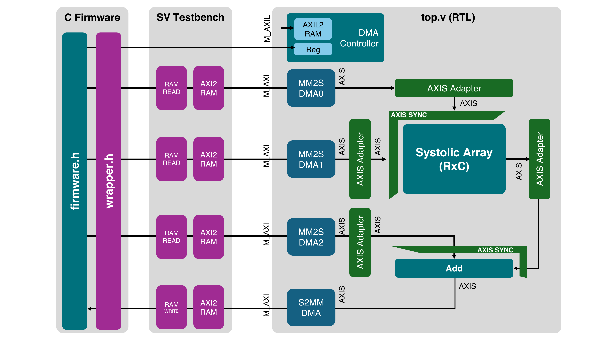
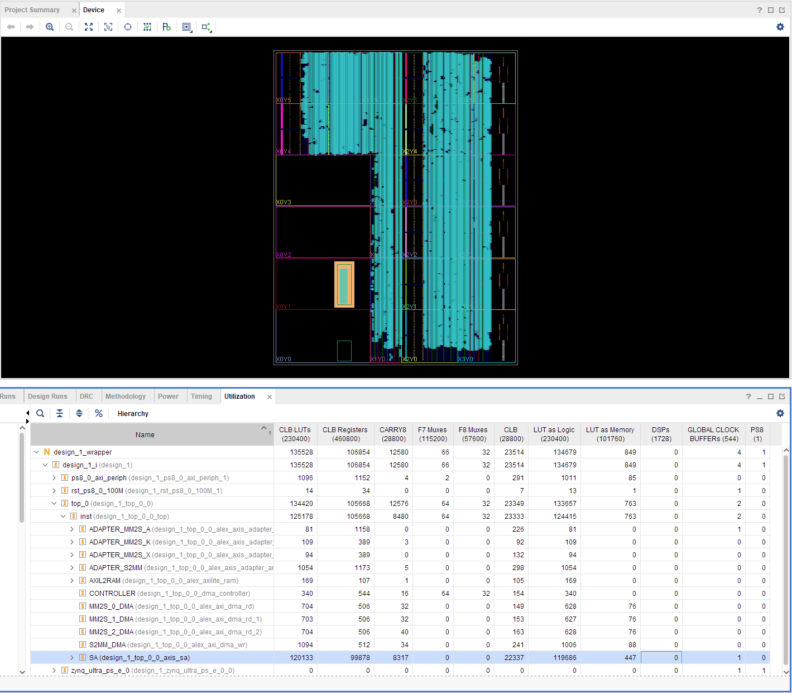

# AXI Stream Systolic Array

```
# Matrices:
k: (K,C) # Weights
x: (K,R) # Inputs
a: (C,R) # Partial sums
y: (C,R) # Outputs

The system performs:
y(C,R) = k.T(C,K) @ x(K,R) + a(C,R)
```



## Key files

* `run/config.py` - Generates `run/work/config.svh`, `run/work/config.h` and `run/work/config.tcl` based on params passed
* `run/golden.py` - Python reference that performs `y = k.T @ x + a`
* `run/sources_axi.txt` - List of source files needed for simulation
* `tb/top_axi_tb.sv` - Top testbench
* `rtl/sys/top_axi.v` - Top RTL module with 4 M_AXI & one S_AXIL ports.
* `c/firmware.h` - Contains the basic firmware
* `rtl/sys/dma_controller.sv` - DMA controller that corresponds with firmware
* `rtl/sa/axis_sa.sv` - AXI Stream Systolic array

## To simulate the subsytem in various configurations

* Build [verilator](https://github.com/verilator/verilator) from source & install it (recommended)
* Make sure your compilers/simulators are in `$PATH`
* For Windows, install Git bash from [here](https://gitforwindows.org/) to be able to run Makefiles.

Use the template:
```bash
make <TOOL> SYS=<CFG>
```

Where:
* `<TOOL>`:
  * `veri` - Verilator
  * `xsim` - Vivado XSim 
  * `xrun` - Xcelium
* `<CFG>`
  * `axi` - 5 AXI ports. One S_AXIL and four M_AXI. Full-throughput 
  * `axi_int` - 2 AXI ports. 4xM_AXI merged into one via interconnect
  * `ram` - simplified RAM ports x 5 (Known issues)

Examples
```
make veri SYS=axi       # Verilator, 5 AXI ports
make xsim SYS=axi_int   # Vivado, 2 AXI ports
make xrun SYS=ram       # Xcelium, simplified RAM ports
```

## Build and Simulate a Full SoC (System on Chip) with Ibex RISC-V processor

Check the [GitHub Actions workflow](https://github.com/abarajithan11/axis-systolic-array/blob/aba-ibex-soc/.github/workflows/verify.yaml) for more details

1. Install Python dependencies `pip3 install -U -r ibex-soc/python-requirements.txt`
1. Get the latest RISC-V toolchain supported by lowRISC [from here](https://github.com/lowRISC/lowrisc-toolchains/releases)
1. [Optional] Add symlinks mapping `riscv64` to `riscv32` using 
  ```
  for t in g++ gcc ld objcopy objdump; do sudo ln -sf "$(command -v riscv64-unknown-elf-$t)" "/usr/local/bin/riscv32-unknown-elf-$t"; done
  ```
1. Add Systolic Array to FuseSoC `fusesoc library add sa_ip "$(pwd -P)"`
1. Use the following commands:

```
make ibuild      # Build hardware (takes a few minutes)
make irun        # Build software, run simulation and print console output
make iprint      # Print output
make iclean      # Clean build & run
make irun-clean  # Clean only run
```

Key files:

* `ibex-soc\examples\simple_system\rtl\ibex_simple_system.sv` - Top level SV of SoC
* `ibex-soc\examples\sw\simple_system\hello_test\hello_test.c` - Top firmware that gets compiled
* `ibex-soc\examples\sw\simple_system\hello_test\firmware_helpers.h` - Firmware helpers
* `sa_for_ibex.core` - Defines this repo as a FuseSOC module


## Implement on Xilinx FPGAs

### Vivado: 

```
make vivado BOARD=zcu104
make vivado BOARD=zcu102
```

### Vitis:

1. Launch SDK, create a new application project, select `Custom XSA` and select `run/work/sa_zcu104/design_1_wrapper.xsa`.
1. Choose Hello World template.
1. Copy and paste the contents of `c/xilinx_example.c` to `helloworld.c`
1. Right click on project, `C/C++ build settings`, select `Directories` and add `c/` to the include path.
1. Build the project.
1. Connect the ZCU104 to the host machine, turn it on.
1. Right click on the project, `Run As`, `Debug: Launch on Hardware (Single Application Debug)`
1. Open Vitis serial console and connect to the correct COM port.
1. Click `Resume` to run the program.

## Resources & Performance

Following was done on ZCU104. 
```
R=32,
C=32,
AXI_WIDTH=128
WK=8
WX=8
WA=32
WY=32
FREQ=100MHz
```

