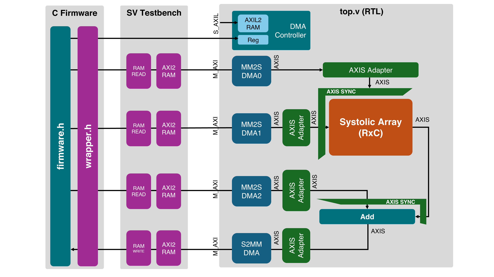

# AXI Stream Systolic Array

```
# Matrices:
k: (K,C) # Weights
x: (K,R) # Inputs
a: (C,R) # Partial sums
y: (C,R) # Outputs

The system performs:
y(C,R) = k.T(C,K) @ x(K,R) + a(C,R)
```



## Key files

* `run/config.py` - Generates `run/work/config.svh`, `run/work/config.h` and `run/work/config.tcl` based on params passed
* `run/golden.py` - Python reference that performs `y = k.T @ x + a`
* `run/sources_axi.txt` - List of source files needed for simulation
* `tb/top_axi_tb.sv` - Top testbench
* `rtl/sys/top_axi.v` - Top RTL module with 4 M_AXI & one S_AXIL ports.
* `c/firmware.h` - Contains the basic firmware
* `rtl/sys/dma_controller.sv` - DMA controller that corresponds with firmware
* `rtl/sa/axis_sa.sv` - AXI Stream Systolic array

## Setting up Simulators & Environment:

### Windows

You need `make` to run our `Makefile`. If you dont have `make` on Windows native, follow these steps

1. Install `chocolatey`

Open powershell as administrator and run the following command:

```
Set-ExecutionPolicy Bypass -Scope Process -Force; `
[System.Net.ServicePointManager]::SecurityProtocol = `
[System.Net.ServicePointManager]::SecurityProtocol -bor 3072; `
iex ((New-Object System.Net.WebClient).DownloadString('https://community.chocolatey.org/install.ps1'))
```

2. Install `make` and GNU tools

```
choco install make
choco install gnuwin32-coreutils.install
```

3. Add `C:/Program Files (x86)/GnuWin32/bin` to your `$PATH`


### To simulate the Subsystem with AXI ports

```
make veri SYS=axi   # Verilator
make xsim SYS=axi   # Xilinx/AMD Vivado
make xrun SYS=axi   # Cadence Xcelium
```

### To simulate the Subsystem with simplified RAM ports

```
make xsim SYS=ram
make veri SYS=ram
make xrun SYS=ram
```


### Test on Xilinx FPGAs

#### Vivado: 

```
make vivado BOARD=zcu104
make vivado BOARD=zcu102
```

#### Vitis:

1. Launch SDK, create a new application project, select `Custom XSA` and select `run/work/sa_zcu104/design_1_wrapper.xsa`.
1. Choose Hello World template.
1. Copy and paste the contents of `c/xilinx_example.c` to `helloworld.c`
1. Right click on project, `C/C++ build settings`, select `Directories` and add `c/` to the include path.
1. Build the project.
1. Connect the ZCU104 to the host machine, turn it on.
1. Right click on the project, `Run As`, `Debug: Launch on Hardware (Single Application Debug)`
1. Open Vitis serial console and connect to the correct COM port.
1. Click `Resume` to run the program.

## For Ibex

1. Set up & run [Ibex Simple System](https://github.com/lowRISC/ibex/tree/master/examples/simple_system)
1. Run `fusesoc library add sa_ip /root/of/this/repo`
1. Check if it is added `fusesoc core show vendor:sa:sa_for_ibex`
1. `cd ibex_soc`
1. `make build_run_simple`

## Resources & Performance

Following was done on ZCU104. 
```
R=32,
C=32,
AXI_WIDTH=128
WK=8
WX=8
WA=32
WY=32
FREQ=100MHz
```

